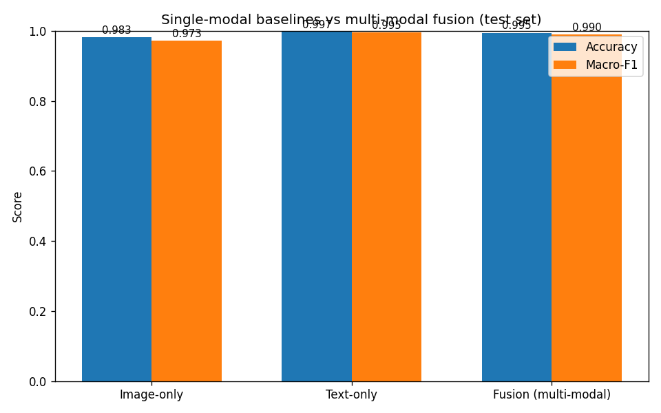

<!--
This is a Marp slide deck. Render to PDF/PPTX/HTML with the Marp CLI or the
VS Code "Marp for VS Code" extension:
    npx @marp-team/marp-cli docs/PRESENTATION.md --pdf
Slides are separated by `---`. Speaker notes are in HTML comments like this one.
-->

# Multi-Modal Deep Learning for Fashion Product Classification

### Image + Text → product category

**Team:** A (image/CNN) · B (text/RNN) · C (data, fusion, infra)
Deep Learning course project

<!-- One-liner: we combine a picture and a text description to classify a product,
and we test whether using both beats either one alone — and analyse when it helps. -->

---

## The question

> Does combining **image** and **text** beat using **either modality alone**?

- Input: a product **image** + its **text** description (`productDisplayName`)
- Output: the product's `subCategory` (top-10 classes)
- We train **three** models on the **same** pipeline and compare:
  1. 🖼️ image-only  2. 📝 text-only  3. 🔗 **fusion**

**The 3-way comparison is the whole point of the project.**

---

## Dataset

- Kaggle **Fashion Product Images (small)** — ships images *and* labels *and* text
- Target: **`subCategory`**, top-10 most frequent classes
  - `masterCategory` → too easy (fusion invisible)
  - `articleType` → 140+ classes (too hard)
- Text field: `productDisplayName`
- **Stratified 70 / 15 / 15** split, fixed seed → identical for all 3 models

<!-- Choosing the right label granularity is what makes fusion's benefit measurable. -->

---

## Architecture overview

```
 image ─► EfficientNetB0 (frozen) ─► GAP ─► Dense(256) ─┐
                                                        ├─► Concat ─► Dense(256)
 text  ─► TextVectorize ─► Embedding ─► GRU(128) ─► Dense(128) ─┘   ─► Dropout(0.3)
                                                                    ─► Softmax(10)
```

- Image-only & text-only baselines reuse the **identical encoders** → fair test
- Keras **functional API**, TensorFlow, runs on **Colab free GPU**

---

## Image branch — CNN

- **Convolution**: shared local kernels → translation-equivariant features
$$Z_{i,j,f} = b_f + \sum_{c,u,v} K^{(f)}_{u,v,c}\,X_{i s+u,\,j s+v,\,c}$$
- **Activation** (nonlinearity): ReLU $\max(0,z)$; EfficientNet uses Swish $z\,\sigma(z)$
- **Pooling**: Global Average Pooling → one vector per channel (no params)
- **EfficientNetB0**, ImageNet weights, **frozen**: transfer learning, less overfit, cheap, BN in inference mode

---

## Text branch — Embedding + GRU

- Trainable **embedding** $E\in\mathbb{R}^{V\times d}$ (no GloVe/BERT — short text)
- **GRU** gates control memory across the sequence:
$$z_t=\sigma(W_z e_t+U_z h_{t-1}),\quad r_t=\sigma(W_r e_t+U_r h_{t-1})$$
$$\tilde h_t=\tanh(W_h e_t+U_h(r_t\odot h_{t-1}))$$
$$h_t=(1-z_t)\odot h_{t-1}+z_t\odot \tilde h_t$$
- **Update gate** $z_t$ = carry vs. write; **reset gate** $r_t$ = forget history
- Final state $h_L$ → Dense(128) = text encoding

<!-- The additive carry path (1 - z_t) is what fixes vanishing gradients. -->

---

## Fusion — why concatenation + FC works

$$a = [\,a_{\text{img}}^{(256)} ; a_{\text{txt}}^{(128)}\,]\in\mathbb{R}^{384}$$

$$h_m = \mathrm{ReLU}\Big(\sum_i W^{\text{img}}_{m,i}a_{\text{img},i} + \sum_j W^{\text{txt}}_{m,j}a_{\text{txt},j} + b_m\Big)$$

- A hidden unit can fire only when **a visual feature *and* a textual feature co-occur** → learns **cross-modal conjunctions**
- When the image is ambiguous, the text disambiguates — and vice-versa
- Dropout(0.3) regularises the only high-capacity trainable part

---

## Loss & optimisation

- **Softmax** → class probabilities; **cross-entropy** loss
$$\mathcal{L}=-\log\hat y_c,\qquad \frac{\partial\mathcal{L}}{\partial o_k}=\hat y_k-\mathbb{1}[k=c]$$
- **Adam** — adaptive per-parameter steps (momentum + RMS):
$$\theta_t=\theta_{t-1}-\eta\,\frac{\hat m_t}{\sqrt{\hat v_t}+\epsilon}$$
- Early stopping on val loss (patience 3, restore best); seed = 42 everywhere

---

## Experimental setup

| | |
|---|---|
| Optimiser | Adam, lr 1e-3 |
| Loss | sparse categorical cross-entropy |
| Batch / epochs | 32 / ≤15 (early stop) |
| Image | 224×224, EfficientNetB0 frozen |
| Text | vocab 10k, seq len 20, emb 128, GRU 128 |
| Eval | stratified held-out test (not k-fold — compute) |
| Tuning | small **manual** grid (lr, dropout, FC width) |

All hyperparameters centralised in `src/config.py`.

---

## Results — the 3-way comparison

| model | accuracy | macro-F1 |
|---|---|---|
| Image-only | 0.9827 | 0.9727 |
| **Text-only** | **0.9970** | **0.9949** |
| Fusion | 0.9947 | 0.9905 |

**Headline:** text **saturates** the task → fusion **ties** the best modality
(ΔF1 −0.004, within noise) and both **beat image-only** (+0.018).

---

## Results — visualised



Accuracy and macro-F1 are visually indistinguishable for text and fusion; image-only
trails on both — fusion **matches** the dominant modality rather than beating it.

---

## What the confusion matrices show

- Per-model `confusion_matrix.png` saved in `artifacts/<model>/`
- Fusion **repairs the image branch's worst confusions** by leaning on text:
  - 🖼️ image-only struggles on *Sandal* (F1 0.897, confused with *Shoes*) and *Innerwear* (0.941)
  - 🔗 fusion lifts them to **0.968** and **0.983**
- 📝 text-only is already near-perfect → fusion's gains show up **per-class**, not in the average
- We report **macro-F1** because the top-10 classes are imbalanced

---

## Limitations & honest scope

- Small dataset images ~60×80 upscaled → visual ceiling
- `productDisplayName` is *very* informative → strong text baseline (less fusion headroom)
- Single held-out split (not k-fold) — justified by compute
- Backbone frozen (stage-2 fine-tuning = optional stretch)
- Trainable embedding instead of pretrained vectors

<!-- If fusion doesn't win outright, that's still a valid, analysed result. -->

---

## Takeaways

- Built the full mandated pipeline: **CNN + RNN + fusion**, end to end
- Derived the **math** of every component (conv/pool/activation, GRU gates, cross-entropy + Adam, fusion)
- **Fair** comparison: identical pipeline, shared encoders, no leakage
- **Reproducible**: fixed seed, persisted vocab, one-click Colab notebook
- Central result: text **saturates** this task → fusion **ties** it and both **beat image**;
  fusion's gains are **per-class** (recovers image's hardest categories)

### Thank you — questions?
